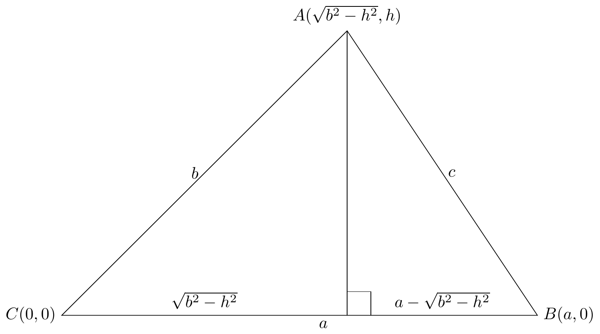

# Proving Heron's Formula

{width=80%}

```{tikz echo=FALSE, eval=TRUE}
\begin{tikzpicture}
% Draw the triangle and the right angle
\draw (0,0)--(10,0)--(6,6)--cycle;
\draw (6,6)--(6,0);
\draw (6,0)  rectangle (6.5,0.5);

% Draw the vertex labels
\node[left] at (0,0) {\( C(0, 0) \)};
\node[above] at (6,6) {\( A(\sqrt{b^2 - h^2}, h) \)};
\node[right] at (10,0) {\( B(a, 0) \)};

% Label the sides
\node[below] at (5.5,0) {\( a \)};
\node[left] at (3,3) {\( b \)};
\node[right] at (8,3) {\( c \)};

% Give labels to the two subdivisions of the base
\node[above] at (3,0) {\( \sqrt{b^2 - h^2} \)};
\node[above] at (8,0) {\( a - \sqrt{b^2 - h^2} \)};
\end{tikzpicture}
```

Here is a simple proof of Heron's formula using Cartesian geometry.
Here is a simple proof of Heron's formula using Cartesian geometry.
Here is a simple proof of Heron's formula using Cartesian geometry.
Here is a simple proof of Heron's formula using Cartesian geometry.

<div class="scroll-wrapper" markdown="block">
$$
\begin{aligned}
a - \sqrt{b^2 - h^2} &= \sqrt{c^2 - h^2} \\
(a - \sqrt{b^2 - h^2})^2 &= (\sqrt{c^2 - h^2})^2 \\
a^2 - 2a\sqrt{b^2 - h^2} + (b^2 - h^2) &= (c^2 - h^2) \\
a^2 + b^2 - h^2 - 2a\sqrt{b^2 - h^2} &= c^2 - h^2 \\
(a^2 + b^2 - c^2)^2 &= (2a\sqrt{b^2 - h^2})^2 \\
(a^2 + b^2 - c^2)(a^2 + b^2 - c^2) &= 4a^2(b^2 - h^2) \\
a^4 + b^4 + c^4 + 2a^2b^2 - 2a^2c^2 - 2b^2c^2 &= 4a^2b^2 - 4a^2h^2 \\
4a^2h^2 &= -a^4 - b^4 - c^4 - 2a^2b^2 + 4a^2b^2 + 2a^2c^2 + 2b^2c^2 \\
4a^2h^2 &= -a^4 - b^4 - c^4 + 2a^2b^2 + 2a^2c^2 + 2b^2c^2 \\
h &= \sqrt{\dfrac{-a^4 - b^4 - c^4 + 2a^2b^2 + 2a^2c^2 + 2b^2c^2}{4a^2}} \\
h &= \dfrac{1}{2a} \sqrt{-a^4 - b^4 - c^4 + 2a^2b^2 + 2a^2c^2 + 2b^2c^2} \\
\Delta &= \dfrac{1}{2} \times \text{base $\times$ height, where base $= a$} \\
\Delta &= \dfrac{1}{2} \times a \times \dfrac{1}{2a} \sqrt{-a^4 - b^4 - c^4 + 2a^2b^2 + 2a^2c^2 + 2b^2c^2} \\
\Delta &= \dfrac{1}{4} \sqrt{-a^4 - b^4 - c^4 + 2a^2b^2 + 2a^2c^2 + 2b^2c^2} \\
\Delta &= \dfrac{1}{4} \sqrt{-a^4 - b^4 - c^4 + 2a^2b^2 + 2a^2c^2 - 2b^2c^2 + 4b^2c^2} \\
\Delta &= \dfrac{1}{4} \sqrt{4b^2c^2 - (a^4 + b^4 + c^4 - 2a^2b^2 - 2a^2c^2 + 2b^2c^2)} \\
\text{Let}\; \alpha &= a^4 + b^4 + c^4 - 2a^2b^2 - 2a^2c^2 + 2b^2c^2 \\
&= a^4 + b^4 + c^4 - a^2b^2 - a^2b^2 - a^2c^2 - a^2c^2 + b^2c^2 \\
    &\qquad\quad + b^2c^2 \\
&= a^4 - a^2b^2 - a^2c^2 + b^4 - a^2b^2 + b^2c^2 + c^4 - a^2c^2 \\
    &\qquad\quad + b^2c^2 \\
&= a^2(a^2 - b^2 - c^2) + b^2(b^2 - a^2 + c^2) + c^2(c^2 - a^2 + b^2) \\
&= a^2(a^2 - b^2 - c^2) + b^2(-a^2 + b^2 + c^2) \\
		&\qquad\quad + c^2(-a^2 + b^2 + c^2) \\
&= -a^2(-a^2 + b^2 + c^2) + b^2(-a^2 + b^2 + c^2) \\
		&\qquad\quad + c^2(-a^2 + b^2 + c^2) \\
&= (-a^2 + b^2 + c^2)(-a^2 + b^2 + c^2) \\
\alpha &= (-a^2 + b^2 + c^2)^2
\end{aligned}
$$
</div>

<div class="scroll-wrapper" markdown="block">
$$
\begin{aligned}
\text{Thus,}\; \Delta &= \dfrac{1}{4} \sqrt{4b^2c^2 - (-a^2 + b^2 + c^2)^2} \\
\Delta &= \dfrac{1}{4} \sqrt{(2bc)^2 - (-a^2 + b^2 + c^2)^2} \\
\Delta &= \dfrac{1}{4} \sqrt{(2bc - (-a^2 + b^2 + c^2))(2bc + (-a^2 + b^2 + c^2))} \\
\Delta &= \dfrac{1}{4} \sqrt{(2bc + a^2 - b^2 - c^2)(2bc - a^2 + b^2 + c^2)} \\
\text{Let}\; m &= 2bc + a^2 - b^2 - c^2 \\
m &= a^2 - b^2 - c^2 + ab - ab + ac - ac + bc + bc \\
&= (a^2 + ac - ab) + (-b^2 + bc + ab) + (-c^2 + bc - ac) \\
&= a(a + c - b) - b(b - c - a) - c(c - b + a) \\
&= a(a + c - b) + b(a + c - b) - c(a + c - b) \\
m &= (a + b - c)(a + c - b) \\
\text{Let}\; n &= 2bc - a^2 + b^2 + c^2 \\
n &= -a^2 + b^2 + c^2 + ab - ab + ac - ac + bc + bc \\
&= (-a^2 + ac + ab) + (b^2 + bc - ab) + (c^2 + bc - ac) \\
&= a(-a + c + b) + b(b + c - a) + c(c + b - a) \\
&= a(b + c - a) + b(b + c - a) + c(b + c - a) \\
n &= (a + b + c)(b + c - a) \\
\Delta &= \dfrac{1}{4} \sqrt{mn} \\
&= \sqrt{\dfrac{mn}{16}} \\
&= \sqrt{\dfrac{(a + b - c)(a + c - b)(a + b + c)(b + c - a)}{16}} \\
&= \sqrt{\dfrac{a + b + c}{2} \times \dfrac{b + c - a}{2} \times \dfrac{a + c - b}{2} \times \dfrac{a + b - c}{2}} \\
&= \sqrt{\dfrac{a + b + c}{2} \times \dfrac{a + b + c - 2a}{2} \times \dfrac{a + b + c - 2b}{2} \times \dfrac{a + b + c - 2c}{2}} \\
&= \sqrt{\left(\dfrac{a + b + c}{2}\right) \times \left(\dfrac{a + b + c}{2} - a\right) \times \left(\dfrac{a + b + c}{2} - b\right) \times \left(\dfrac{a + b + c}{2} - c\right)} \\
\text{Let}\; S &= \dfrac{a + b + c}{2}, \\
\text{then}\; \Delta &= \sqrt{S(S - a)(S - b)(S - c)}
\end{aligned}
$$
</div>

Heron's formula proved!